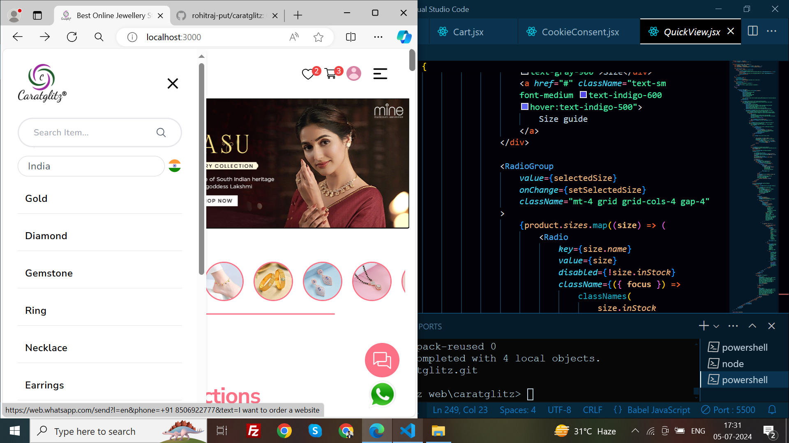

# CARATGLITZ [E-COMMERCE WEBSITE]
This template provides a minimal setup to get React working in Vite with HMR and some ESLint rules.

Currently, two official plugins are available:

- [@vitejs/plugin-react](https://github.com/vitejs/vite-plugin-react/blob/main/packages/plugin-react/README.md) uses [Babel](https://babeljs.io/) for Fast Refresh
- [@vitejs/plugin-react-swc](https://github.com/vitejs/vite-plugin-react-swc) uses [SWC](https://swc.rs/) for Fast Refresh

- ### Development

Want to run demos locally

```bash
git clone [https://github.com/rohitraj-put/caratglitz.git]
cd caratglitz
npm install
npm run dev
open http://localhost:3000
```

## Table of Contents

- [Demo](#demo)
- [Features](#features)
- [Tech Stack](#tech-stack)
- [Installation](#installation)

## Demo

You can visit the live website at [CaratGlitz Demo](https://caratglitzweb.netlify.app/)

## Features

- User authentication (login and register)
- Responsive design
- Product listing with detailed views
- Shopping cart functionality
- Secure payment gateway integration (Currently Disable)
- Admin panel for product management

## Tech Stack

- **Frontend:** React, Vite
- **State Management:** Redux, Context API
- **Styling:** Tailwind CSS
- **Routing:** React Router
- **Notifications:** react-hot-toast

Directory structure:
└── rohitraj-put-caratglitz/
    ├── README.md
    ├── index.html
    ├── package.json
    ├── postcss.config.js
    ├── tailwind.config.js
    ├── vite.config.js
    ├── .eslintrc.cjs
    ├── public/
    └── src/
        ├── App.css
        ├── App.jsx
        ├── index.css
        ├── input.css
        ├── main.jsx
        ├── output.css
        ├── assets/
        │   └── image/
        │       ├── box2.webp
        │       ├── box3.webp
        │       ├── box4.webp
        │       └── slider2.webp
        ├── components/
        │   ├── AnimatedNumber.jsx
        │   ├── Carousel.jsx
        │   ├── Cart.jsx
        │   ├── Category.jsx
        │   ├── Currency.jsx
        │   ├── Feedback.jsx
        │   ├── Footer.jsx
        │   ├── Header.jsx
        │   ├── Home.jsx
        │   ├── Loading.jsx
        │   ├── MidSec.jsx
        │   ├── Navbar.jsx
        │   ├── NotFoundPage.jsx
        │   ├── ProductCard.jsx
        │   ├── ProductDetail.jsx
        │   ├── ProductFeature.jsx
        │   ├── ProductSlider.jsx
        │   ├── ProductVeraity.jsx
        │   ├── Products.jsx
        │   ├── QuickView.jsx
        │   ├── QuickWishlist.jsx
        │   ├── ScrollTop.jsx
        │   ├── Wishlist.jsx
        │   ├── Authentication/
        │   │   ├── LogoutConfirm.jsx
        │   │   ├── Register.jsx
        │   │   └── SignIn.jsx
        │   ├── Cookie/
        │   │   └── CookieConsent.jsx
        │   ├── ProductCategory/
        │   │   ├── Earrings.jsx
        │   │   ├── Necklace.jsx
        │   │   ├── Pendant.jsx
        │   │   └── Ring.jsx
        │   └── userProfile/
        │       └── User.jsx
        ├── data/
        │   └── ProductData.js
        └── redux/
            ├── actionTypes.js
            ├── actions.js
            ├── reducer.js
            └── store.js


- ### Fully Responsive website



